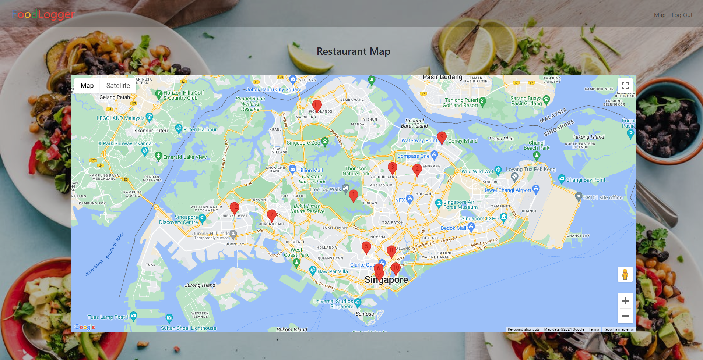

#### Video Demo:  [URL HERE](https://youtu.be/oKhzwdV9dH8)

## Description: 
##### Document Your Food Journey with FoodLogger which is a simple web application made to assist users to track and record the restaurants that they have eaten at. User can input the Restaurant name, whether it is your favourite, rating, Critics and Location. Through usage of flask, this application have an intuitive interface for its functions. There is a page that utilise google map API to display the location of your restaurants.

## **Navigation Flow:**
## 1. Login Page:
>- After starting the Flask application, users will be redirected to /login route which will show the login page as seen above which comes from $${\color{red}login.html}$$.
>- In order to log in, both username and password must be filled.
>- After clicking the Log In button, a backend verification against the users table in $${\color{red}finalproject.db}$$ is performed to authenticate credentials.
>- Once verification is successful, user will be redirected to the homepage.

## 2. Registration Page
>- Users without account can click sign up link to be redirected to /register route which shows the registration page coming from $${\color{red}Registration.html}$$.
>- Similar to log in page, all fields must be filled.
>- Once sign up is successful, user will be redirected to the homepage.

## 3. Home Page
>- The home page contains several navigation buttons like the logo, Add Restaurant, Map and Log out which route to $${\color{red}/}$$, $${\color{red}/add}$$, $${\color{red}/map}$$ and $${\color{red}/logout}$$ respectively via GET method.

## 4. Add Restaurant Page
>- At this page, Users can add the restaurant that they have patronised by filling up the form and clicking the add button.
>- The form then records the various informations and routes to the homepage via POST, saving these information to the restaurants table in $${\color{red}finalproject.db}$$

## 5. Sort and Search Feature
>- In the homepage, I have added 2 other feature -- Search and Sort.
>- When any of the table header is clicked, $${\color{red}sortTable}$$ function from $${\color{red}sortsearch.js}$$ will run which sorts the rows based on increasing/decreasing value.
>- User can also perform a live search by filling input field. Upon key up by the user, $${\color{red}searchTable}$$ function from $${\color{red}searchsort.js}$$ will run and give the results immediately.
>- Lastly, by pressing the $${\color{red}DELETE}$$ button, the restaurant will be immediately removed from $${\color{red}finalproject.db}$$.

## 6. MAP!
>- Accessible via the "Map" button, this page routes to $${\color{red}/map}$$ via GET and display a map with markers obtained from $${\color{red}finalproject.db}$$.
>- Through the usage of Geocoding API, I was able to loop through the restaurant table in $${\color{red}finalproject.db}$$ and obtain each location's latitude and longitude and pushed them into a $${\color{red}eatery}$$ array.
>- Then through the usage of Google Map API, I was able to initialised a map and loop through the $${\color{red}eatery}$$ array to set up markers for map. 
>- All these information are then displayed in the $${\color{red}map.html}$$

## **Technical Specifications:**
- #### **Framework**: Flask
- #### **Database**: Sqlite(finalproject.db)
- #### **Template Files**: $${\color{red}_add.html_  _apology.html_  _index.html_  _layout.html_  _login.html_  _map.html_  _register.html_}$$, 
- #### **Framework**: Geocoding and Google Map API

## How to install and run FoodLogger

#### Requirements

Ensure that the following are installed:
- Python 3
- pip (Python's package installer)

#### Installation

1. **Clone the repository**:
   ```bash
   git clone https://github.com/K-Hibari/FoodLogger.git
   cd FoodLogger
   
2. **Install required packages**
   ```bash
   pip install -r requirements.txt

4. **Run app**:
   ```bash
   flask run

#### To stop application
Press `CTRL` + `C` in the terminal to stop webapp